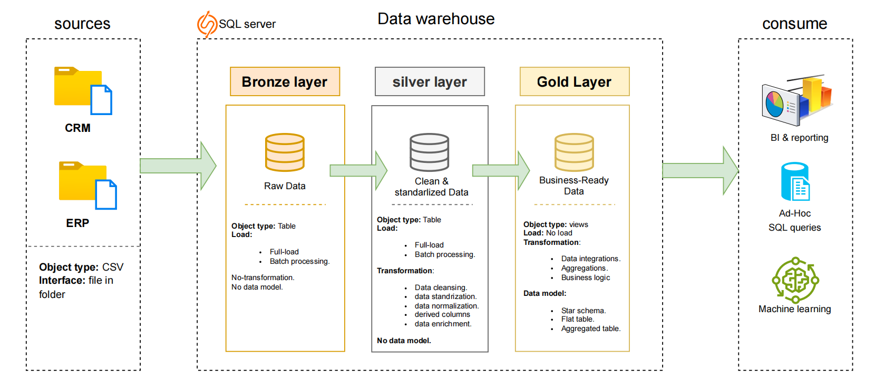

# Enterprise Sales Data Warehouse &amp; Analytics Platform: A Medallion Architecture Implementation
This repository documents the development of a modern, analytical data warehouse built on SQL Server. The primary goal of this project is to consolidate sales-related operational data from disparate source systems (CRM and ERP) into a unified, high-quality data platform. This architecture is designed to support robust Business Intelligence (BI) reporting and drive data-informed decision-making.

#### The project demonstrates expertise across the entire data lifecycle, from initial ingestion and cleansing to final star schema modeling and analytical query development.

The data architecture follows Medallion Architecture:

### 🏗️ Architectural Approach: The Medallion Framework

This data platform is structured using the industry-standard Medallion Architecture, providing clear separation of concerns, governance, and quality across three distinct layers within the SQL Server database.

1. 🥉**Bronze Layer**: Archival of source data as-is, with zero transformations. Direct extraction of CSV file contents into dedicated staging tables within SQL Server. This serves as the single point of truth for raw data
3. 🥈**Silver Layer**: Data governance, standardization, and quality enforcement. Application of data cleansing routines, type casting, standardization (date formats, naming conventions), and resolution of data quality issues, preparing the data for the final model.
4. 🥇**Gold Layer**: Optimized for analytics, reporting, and BI consumption. Modeling the conformed Silver data into a Star Schema (Fact and Dimension tables), ensuring maximum query performance and usability for downstream BI tools.

### 🎯 Key Project Goals

**Data Consolidation**: Integrate raw transaction and customer data from two distinct legacy sources (ERP and CRM CSV files) into a central repository.

**Quality Assurance**: Implement systematic data cleansing, standardization, and normalization procedures to guarantee the accuracy and reliability of the data before analysis.

**Analytical Enablement**: Engineer a highly optimized, user-friendly data model (Star Schema) tailored specifically for complex analytical queries and rapid report generation.

**Actionable Insights**: Develop a suite of analytical reports covering critical business dimensions:
1. Customer Behavioral Analysis: Understanding purchasing patterns and segmentation.
2. Product Performance Deep Dive: Identifying top sellers and underperforming categories.
3. Sales Trend Forecasting: Analyzing temporal shifts and velocity of revenue generation.

#### This project contains:
Data Engineering (ETL): Designing and executing robust Extract, Transform, and Load (ETL) pipelines from source systems into the warehouse.

Data Architecture: Implementing a structured, scalable data framework (Medallion Architecture).

Data Modeling: Developing fact and dimension tables optimized for analytical queries.

Analytics & Reporting: Creating SQL-based reports and dashboards.

Advanced proficiency in T-SQL for data manipulation, transformation, and complex analytical query development.

Data Quality Assurance: Techniques for identifying, diagnosing, and resolving data integrity issues at scale.
